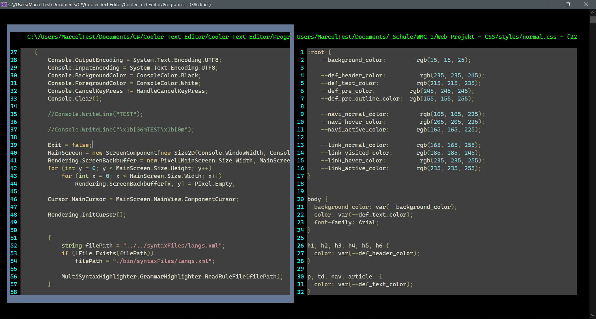
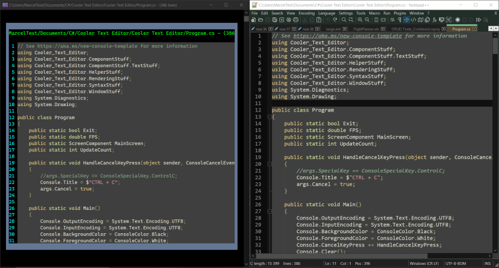

# Cooler-Text-Editor

The cooler and faster Console Text Editor.
Has inbuilt
* Reactive UI System
* Text Editor
* Image Viewer
* Gif Player
* TUI Explorer
* Syntax Highlighting (currently using the Notepad++ rules and a style) (Basic stuff is working)

## Showcase

Showcase of Multiple Components showing different Files

Comparison To Notepad++ bc yes

## Input

### Navigating the Boxes

#### CTRL

* CTRL + LEFT -> Switch hover to left box
* CTRL + RIGHT -> Switch hover to right box
* CTRL + ENTER -> Select hover component
* CTRL + RETURN -> Select parent component

#### ALT
* ALT + J -> Switch hover to left box
* ALT + L -> Switch hover to right box
* ALT + I -> Select hover component
* ALT + K -> Select parent component

### Navigating the File Editor

#### Normal

* Arrow Keys -> Move around
* ALT + O -> Open File
* ALT + S -> Save File
* ALT + SHIFT + S -> Save File as
* ALT + L -> Toggle Line Numbers

### Navigating the Explorer

#### File List
* Arrow Keys -> Move around
* ENTER -> Open File/Drive/Folder
* SHIFT + ESC -> Go up one Folder

#### Search Bar
* ENTER -> Update Search Bar
* SHIFT + ENTER -> Open File/Drive/Folder (only if there is exactly 1 thing left)

#### Path
* Enter -> Update Path and go there

#### Search Mode Box
* ENTER -> Update Mode

#### General
You can switch between the components in the Explorer the same as in the view component.
(Note: there will be no borders)

### Search Modes in the Explorer
|Char|Mode|
|----|----|
|c   |Contains|
|C   |Contains (Case sensitive)|
|s   |Starts With|
|S   |Starts With (Case sensitive)|
|R   |Regex|

### Tabcomponent

* CTRL + TAB -> Switch Tab
* CTRL + T -> Create Tab
* CTRL + W -> Close Tab

### Vertical Splitter

CTRL + W - Delete Selected Horizontal Splitter
CTRL + T - Insert Horizontal Splitter Before
CTRL + T + SHIFT - Insert Horizontal Splitter After

### Horizontal Splitter

CTRL + W - Delete Selected Comp
CTRL + T - Insert File Text Editor Comp Before
CTRL + T + SHIFT - Insert File Text Editor Comp After
CTRL + Z - Insert File Tab Comp Before
CTRL + Z + SHIFT - Insert Tab Comp After
